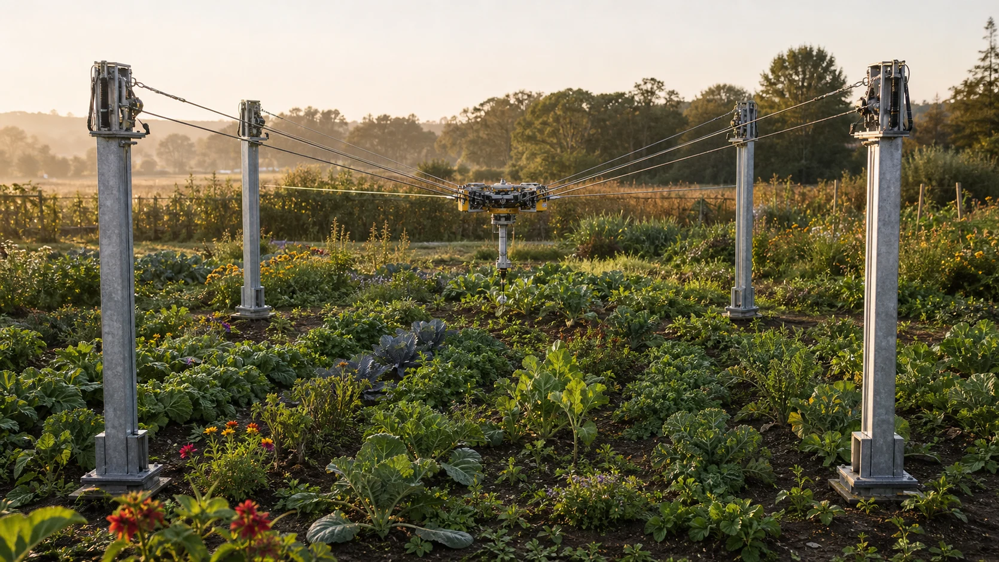
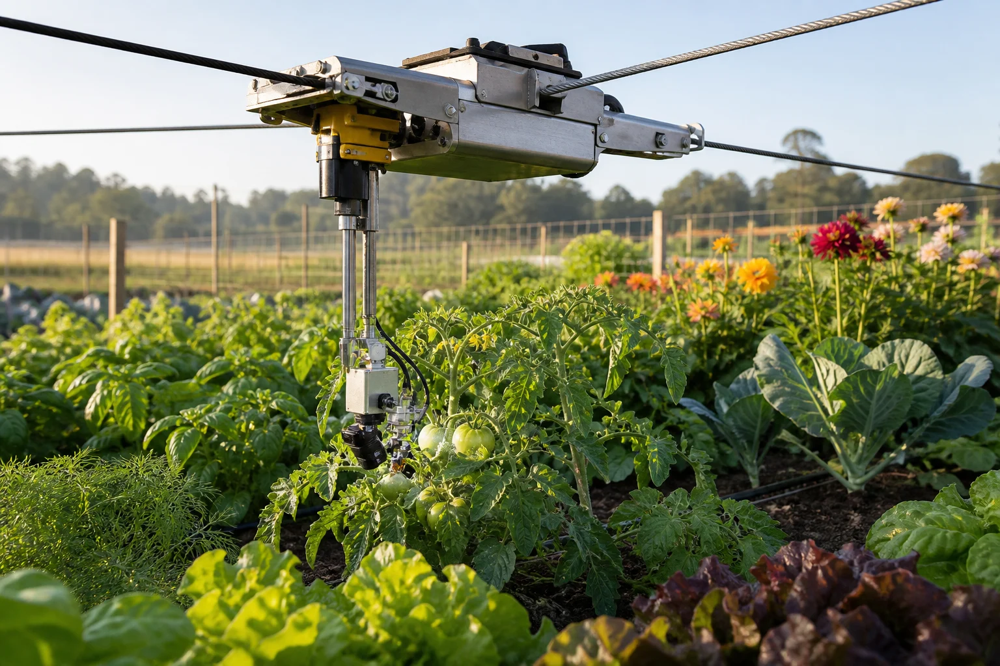
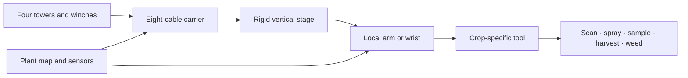

# Farmhand CDPR

### A cable-driven field robot for plant-level agriculture without tractor-defined crop layouts

[](https://github.com/ghanzo/farmhand-cdpr/actions/workflows/ci.yml)
[](https://ghanzo.github.io/farmhand-cdpr/)

**[Open the simulator](https://ghanzo.github.io/farmhand-cdpr/)** ·
**[Read the farm concept](docs/farm-concept.md)** ·
**[Explore the research roadmap](docs/research-roadmap.md)**



*Concept visualization of the proposed four-tower field architecture.*

Farmhand is an open engineering study for a cable-driven parallel robot (CDPR)
that works above a diversified crop plot. Four towers and eight cables move a
carrier across the field; a rigid vertical stage and local tool provide the
last metres of reach and plant-level precision.

The goal is not simply to automate a tractor. It is to investigate what farm
design becomes possible when routine machine traffic no longer passes over the
growing soil and crop spacing is no longer dictated by wheels, implements, and
turning radii.



*The core design hypothesis: macro positioning above the canopy, with a rigid
stage and local tool providing plant-level access.*

> **Research status:** this is an early simulation and design project for a
> 10 × 10 metre pilot—not a certified structure, hardware controller, or safety
> system.

## The idea

Farmhand separates movement into two scales:



- The **CDPR carrier** provides fast, field-scale positioning above the canopy.
- The **vertical stage** lowers tools without turning them into another freely
  suspended pendulum.
- The **local manipulator** supplies final orientation, compliance, foliage
  access, and force control.
- The **service dock** can eventually change tools, refill liquids, unload
  harvest, and calibrate sensors at the field edge.

This macro–micro architecture avoids asking the farm-scale cable system to make
every delicate motion. Force-heavy work such as cultivation or uprooting may
still require a temporary ground brace.

## Interactive simulator

The browser model currently includes:

- four configurable towers and eight individually modeled cables;
- eight distinct platform attachment points;
- rigid-body inverse cable geometry and cable-rate Jacobians;
- bounded positive-tension allocation against gravity;
- acceleration-limited carrier motion;
- cable length, tension, reel speed, and equilibrium telemetry;
- adjustable plot size, tower height, carrier height, moving mass, tool reach,
  and travel speed;
- mixed-crop visualization and click-to-move navigation; and
- first-order operation throughput estimates.

### Operation classes

| Operation | Mechanical character | First-release role |
|---|---|---|
| Multispectral scanning | Non-contact | Primary pilot task |
| Targeted foliar spraying | Low reaction force | Primary pilot task |
| Plant and soil sampling | Precise, moderate force | Instrumented follow-on |
| Delicate harvesting | Vision and compliance limited | Later manipulation study |
| Mechanical weeding | High reaction force | Requires bracing research |

## What the model does not yet solve

The simulator deliberately exposes its boundary. It does not yet model:

- cable sag, elasticity, creep, damping, or thermal effects;
- wind and carrier aerodynamics;
- tower, foundation, and platform deflection;
- pulley friction, fleet angle, gearbox dynamics, brakes, or encoder error;
- closed-loop tension and pose control;
- cable, plant, tool, and human collision avoidance;
- redundant sensing and fault response; or
- measured positioning accuracy under outdoor conditions.

A green feasibility indicator means only that the simplified static model found
a low-residual set of positive cable tensions within the selected limits. Read
the complete [assumptions and limitations](docs/assumptions-and-limitations.md)
before interpreting simulation results.

## Why investigate this?

### Keep routine machine traffic off cropped soil

Farmhand places towers, foundations, winches, and service access at the field
edge. The agronomic hypothesis is that reducing repeated axle traffic can help
preserve pore connectivity, aeration, infiltration, and root access. The target
is well-aggregated soil—not the loosest soil possible.

### Design planting around biology instead of equipment width

Overhead access may make intercropping, relay cropping, living mulches, flower
strips, and non-row spatial patterns easier to manage. It does not prove that
every polyculture will outperform a local benchmark; it expands the layouts
that can be tested and managed mechanically.

### Reuse one positioning system across many tasks

Scanning, targeted applications, sampling, pruning, weeding, and harvesting may
share the same towers and carrier. Whether that produces an economic advantage
depends on throughput, availability, maintenance, crop value, and the cost of
the complete safety-rated structure—not just inexpensive motors and cable.

### Build a plant-level feedback loop

Repeated sensing can create a history for every plant: observations,
applications, samples, symptoms, interventions, and outcomes. That dataset can
support both autonomous operation and controlled agronomic trials.

## Research foundation

Farmhand builds on demonstrated agricultural cable systems and related
research:

- [AgroCableBot](https://doi.org/10.3390/robotics12060165) studies an eight-cable
  reconfigurable agricultural CDPR and tension-feasible workspace.
- The [ETH field phenotyping platform](https://doi.org/10.1071/FP16165)
  demonstrated a cable-suspended sensor system over roughly one hectare.
- [Large-scale agricultural wire-robot analysis](https://doi.org/10.3182/20130327-3-JP-3017.00021)
  addresses elasticity, dynamics, and performance across large spans.
- [CAFEs](https://doi.org/10.48550/arXiv.2503.00514) explores multiple
  lightweight agricultural end effectors sharing cable infrastructure.
- A [hybrid cable robot with a local arm](https://doi.org/10.1109/ICRA48891.2023.10161045)
  demonstrates the same macro–micro principle for plant monitoring.
- A four-season [soil compaction study](https://doi.org/10.1038/s43705-021-00046-8)
  documents persistent changes in soil physical properties and microbial
  communities.
- A synthesis of 98 meta-analyses found that
  [agricultural diversification](https://doi.org/10.1126/sciadv.aba1715)
  generally improved biodiversity and multiple ecosystem services without
  reducing yield overall, while emphasizing context-dependent trade-offs.

The [BibTeX reference library](docs/references.bib) contains the project's core
sources. Advancing Eco Agriculture's Plant Health Pyramid is included as a
practitioner framework whose claims should be converted into measurable
hypotheses—not presented as scientific consensus.

## Run locally

Requires a current Node.js release.

```bash
git clone https://github.com/ghanzo/farmhand-cdpr.git
cd farmhand-cdpr
npm install
npm run dev
```

Then open the local URL printed by Vite.

### Verify the project

```bash
npm test
npm run typecheck
npm run build
```

## Repository map

```text
src/
├── cdpr/           geometry, kinematics, tension, workspace, and reels
├── farm/           operations and throughput models
├── math/           dependency-free vector operations
├── simulation/     motion control and simulation state
├── visualization/  Three.js field, towers, cables, carrier, and crops
└── main.ts          interface and simulation loop

tests/               deterministic engineering checks
docs/                concept, evidence, architecture, economics, and roadmap
.github/workflows/   continuous verification and Pages deployment
```

## Development roadmap

1. **Simulation foundation** — validate geometry, tension-feasible workspace,
   reel behavior, loads, energy, and measurable requirements.
2. **Bench mechanism** — compare a small physical frame with the simulation and
   measure tension, repeatability, backlash, and settling time.
3. **Outdoor pilot** — demonstrate scanning and targeted liquid application
   over a 10 × 10 metre plot.
4. **Compliant manipulation** — add local force sensing, harvesting, sampling,
   pruning, and low-force weeding.
5. **Agronomic trial** — compare soil, biology, plant nutrition, crop health,
   yield, energy, labor, and cost against matched management controls.

Scaling to a hectare is a research gate, not a direct extrapolation from the
pilot. See the full [research roadmap](docs/research-roadmap.md).

## Documentation

- [Farm concept](docs/farm-concept.md)
- [System architecture](docs/system-architecture.md)
- [Agronomic case](docs/agronomy.md)
- [Operations and tooling](docs/operations-and-tools.md)
- [Economics](docs/economics.md)
- [Research roadmap](docs/research-roadmap.md)
- [Assumptions and limitations](docs/assumptions-and-limitations.md)
- [Reference library](docs/references.bib)

## Safety and use

Do not use this software to control physical machinery. A hardware system would
require independent brakes, redundant pose and tension sensing, certified
structures and foundations, exclusion zones, weather limits, fault handling,
and an independently reviewed safety case.

## License

No reuse license has been selected yet. Choose and add a license before inviting
external redistribution or contributions.
