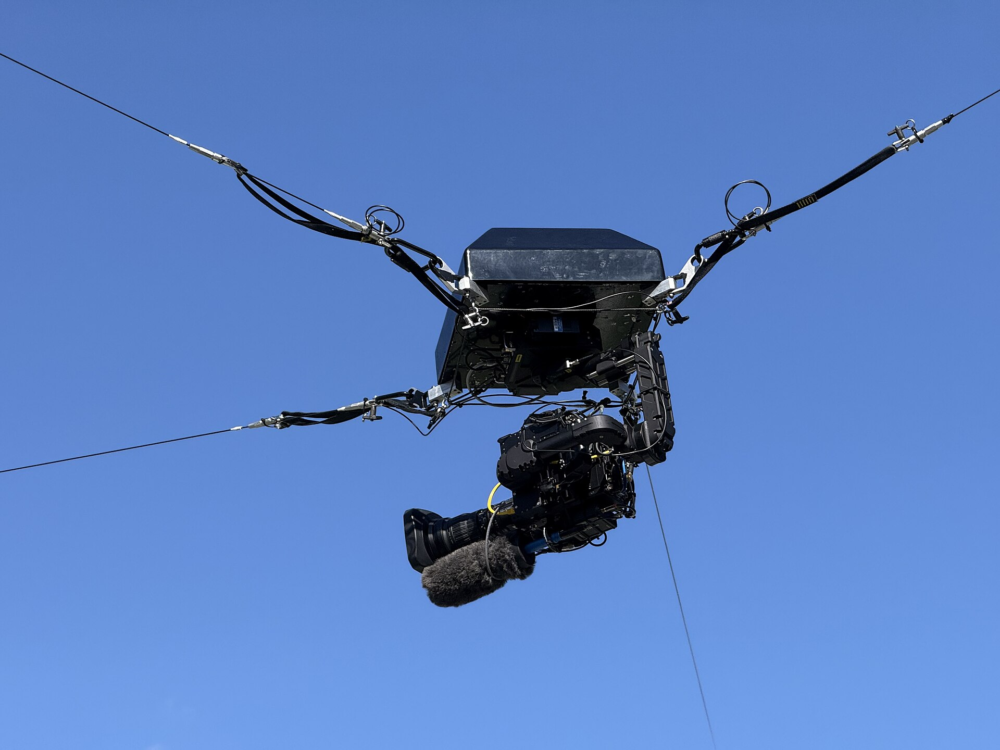
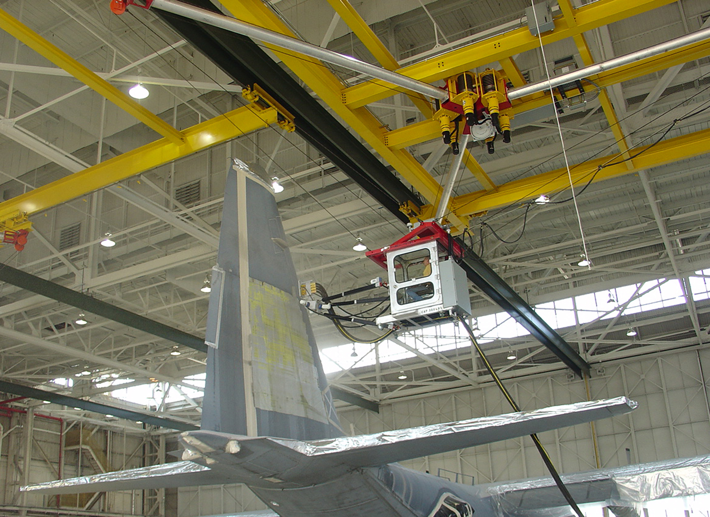

# SkyCam Sim

**▶ Live demo: https://ghanzo.github.io/skycam-cdpr/**

A browser simulator of an **8-cable cable-driven parallel robot (CDPR)**: a
platform held by eight cables from four corner masts — four suspending from
the tower tops, four pulling back from low anchors — the antagonistic
configuration that constrains all six degrees of freedom. The same
architecture scales from broadcast SkyCams (the 4-cable version) to warehouse
cranes (NIST's RoboCrane) to field robots — a gondola that can carry a camera
today and a tool later.

Click anywhere on the field and the platform flies there under an
acceleration-limited motion profile — while eight live motor readouts and a
strip chart show each cable paying out at its own **continuously changing,
non-linear rate**. That contrast is the entire point of the project: simple
platform motion demands non-trivial motor control.


## The CDPR family

The same four-cables-and-winches architecture, at three very different jobs:

| Broadcast | Heavy work |
|---|---|
|  |  |
| A skycam working a Penn State game — the suspended 4-cable CDPR this sim models. *Photo: [Famartin](https://commons.wikimedia.org/wiki/File:2025-08-30_15_40_02_A_skycam_during_a_football_game_at_Beaver_Stadium_at_Pennsylvania_State_University_in_College_Township,_Centre_County,_Pennsylvania.jpg), CC BY-SA 4.0, via Wikimedia Commons* | NIST's RoboCrane suspending a worker cab to strip paint from a USAF C-130 — proof that cable platforms can do real work, not just carry cameras. *Photo: N.E. Wasson Jr./US Technologies, via [NIST](https://www.nist.gov/programs-projects/robocrane)* |

And the biggest CDPR on Earth: the [FAST radio telescope](https://en.wikipedia.org/wiki/Five-hundred-meter_Aperture_Spherical_Telescope)
in China flies its 30-ton receiver cabin over a 500 m dish on six cables from
six towers — millimeter-precision positioning at building scale.

## The math (v3 — motion profiles, dynamics, slack, reels)

Towers hold the cable ends at fixed anchor points **T<sub>i</sub>**; the
commanded camera position is **P** = (x, y, z). Each cable length is 3D
Pythagoras, and the payout rate is the motion projected onto the cable:

```
Lᵢ = |P − Tᵢ|            dLᵢ/dt = ( (P − Tᵢ) · v ) / Lᵢ
```

**Motion profile** — the rig accelerates at a capped rate and its speed is
governed so it can always brake to the target:

```
|v| ≤ min( vmax, √(2 · a · d_remaining) )
```

Retargeting mid-flight just bends the trajectory — no precomputed profile.

**Gondola dynamics** — the rendered gondola is a damped spring chasing the
commanded point (`ẍ = ω²(P_cmd − x) − 2ζω·ẋ`), softer horizontally than
vertically, so it lags under acceleration, swings through stops, and bobs as it
settles. A faint ghost dot marks the commanded position the winches track.

**Cables are assumed taut** — real rigs hold enough preload tension that the
cables stay straight; the sim adopts that assumption and renders every cable
as a straight member.

**Reel geometry** — each winch drum (0.35 yd core, 8 mm cable, 38 wraps per
layer, 300 yd capacity) converts line speed to drum RPM through the effective
radius of the working layer:

```
r_eff = r_core + layer · d_cable        RPM = 60 · |dL/dt| / (2π · r_eff)
```

Same line speed on a different layer → different RPM. That's why real winches
encoder the cable, not just the motor.

**Rigidity** — cables only pull, so constraint comes from cables opposing each
other. This sim runs the full **8-cable configuration**: M1–M4 suspend from the
tower tops, M5–M8 pull from low anchors on the same masts, giving antagonistic
pairs that constrain all six degrees of freedom (RoboCrane / IPAnema style).
Stiffness then scales with preload tension and control gain — the Rigidity
slider stands in for both (vertical is held near critical damping so altitude
only changes when commanded). Remaining real-world upgrades: heavier platform,
input shaping so commands never excite the swing modes, and a self-stabilized
end effector for the last few centimeters of precision.

## Using the sim

- **Click the field** — camera flies there under the acceleration profile
- **Drag / scroll** — orbit and zoom the view
- **Speed / Accel / Height sliders** — vmax (yd/s), amax (yd/s²), altitude (yd)
- **v1 pass** — replays the original demo: one straight midfield pass
- **Lap** — tours the corners at the set height; translations are always flat —
  altitude changes only when you move the Height slider
- **Stop** — brakes at the accel limit; watch the gondola swing and settle
- **Rigidity slider** — cable tension / control stiffness stand-in: loose rope
  at 0%, locked-in tracking at 100%
- Motor panel: cable paid out, signed payout rate (+ out / − in), drum RPM +
  working layer; the chart traces payout rates (last 30 s)

Implementation: a single `index.html` — Three.js (pinned CDN) for the 3D scene,
a hand-rolled canvas strip chart, no build step. Units are yards; the field is a
regulation 120 × 53.3 yd.

## v1 (2022) — where this started

Version 1 reduced the problem to its essence: **one motor, one straight-line
translation, in 2D**, animated with Python turtle graphics. The camera moved at a
constant rate while the top-right motor's step rate changed non-linearly through
the translation. The original write-up, math images, and code are preserved in
[`/v1`](./v1/).

- v1 on Replit: https://replit.com/@gonzo/movement-via-time#main.py
- v1 math on Desmos: https://www.desmos.com/calculator/h2k6fdmklq
