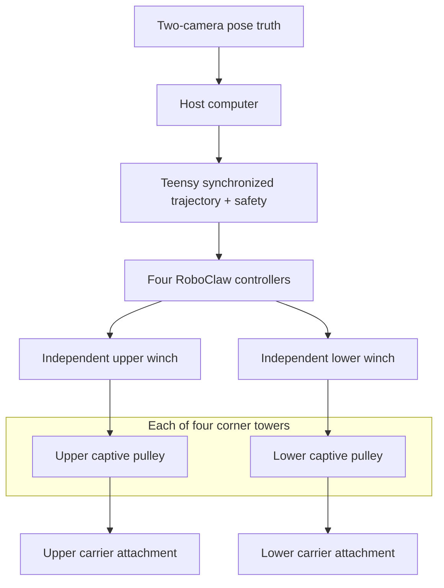

# Eight-cable tabletop 3D testbed

## Purpose

This is the first physical Farmhand experiment: an eight-cable carrier moving
inside a guarded three-dimensional tabletop frame. It is designed to validate
spatial cable geometry, wrench closure, tension allocation, rigidity proxies,
winch speed, coordinated motion, camera-based pose truth, stopping distance,
and emergency behavior.

It does not validate the farm-scale structure, human-safe operation, outdoor
sag, or payload capacity.

## Why eight cables and eight motors

The carrier has six spatial degrees of freedom: translation in `x`, `y`, and
`z`, plus roll, pitch, and yaw. Because a cable can pull but cannot push, a
six-degree-of-freedom platform generally needs more actuators than degrees of
freedom to maintain positive antagonistic tension. This rig uses **eight cables,
eight independent motors, eight encoders, and eight tension channels**.

Cable count alone does not guarantee rigidity. Before motion, each pose must
pass three numerical checks:

1. the 6 × 8 wrench matrix has rank six;
2. a positive bounded tension solution exists; and
3. the weakest singular value and predicted tension margin exceed configured
   thresholds.

## Frame and cable configuration

Four corner columns rise from one rigid tabletop base. Each column provides one
upper and one lower modeled cable anchor. The carrier operates between those
anchor planes.



The carrier is a small cuboid with eight distinct attachment eyes: the four
upper cables connect to its four upper corners and the four lower cables connect
to its four lower corners. This attachment separation provides moment arms for
orientation control. Cable routing remains outside the active volume until each
line exits its captive anchor pulley.

## Proposed geometry and operating limits

| Parameter | Initial target | Reason |
|---|---:|---|
| Overall frame | Approximately 1.1 × 0.9 × 1.0 m | Compact guarded volume on a rigid table or workbench |
| Upper anchor plane | 0.85 m above base | Creates downward cable angles toward the carrier |
| Lower anchor plane | 0.15 m above base | Keeps lower cables clear of the base while pulling downward |
| Commanded workspace | Central 0.50 × 0.35 × 0.30 m | Avoids weak geometry near the frame boundaries |
| Carrier envelope | Approximately 120 × 100 × 60 mm | Provides eight separated attachment points |
| Carrier mass | 150–250 g | Limits kinetic and falling energy |
| Cable preload | 2–3 N | Removes slack and creates antagonistic constraint |
| Normal cable tension | 6 N maximum | Conservative continuous load for the fast reference motors |
| Hardware cutoff | 10 N per cable | Transient fault limit, not normal operating tension |
| Commissioning speed | 0.05 m/s | Used until pose and stop behavior pass |
| Initial 3D speed cap | 0.75 m/s | High speed within a small enclosed workspace |
| Later test ceiling | 1.0 m/s | Locked until full-volume stopping tests pass |
| Maximum acceleration | 1.5 m/s² initially | Limits dynamic tension and frame excitation |
| Drum radius | 20 mm nominal | About 2.1 m/s theoretical line speed at 1,000 RPM |

At the 10 N cutoff, a 20 mm drum requires 0.20 N·m shaft torque
(`T = F × r`). The selected 24 V, 10:1 37D reference motor is rated at roughly
1,000 RPM no-load and 0.54 N·m extrapolated stall torque. Real usable speed must
be measured under tension; stall is not an operating point.

## Table and load path

Use a rigid, non-glass table or workbench that can support at least 40 kg without
racking. The entire robot is built on one 18 mm plywood or torsion-box baseboard.
The table supports that board but is not used as eight separate anchor points.
Clamp the baseboard at four or more locations over a non-marking isolation pad.

If the table is too small or flexible, support the baseboard on two rated
sawhorses or a dedicated portable workbench. Do not attach winches directly to
household furniture.

## Winch architecture

Each cable path is:

```text
24 V encoder gearmotor → 20 mm single-layer drum
→ tension-sensing idler → frame routing → captive anchor pulley
→ one distinct carrier attachment
```

The anchor pulley centre, not the motor shaft, defines the kinematic anchor.
All eight drums must wind one layer only. A changing winding radius directly
changes cable-length calibration. If one layer cannot hold the required travel,
use a capstan with a separate low-force take-up system or a validated level-wind
mechanism.

## Control and power architecture

- Four dual-channel RoboClaw controllers close eight individual encoder loops.
- A Teensy 4.1-class coordinator sends synchronized cable-length trajectories,
  monitors tension and interlocks, and trips the independent motor-enable path.
- A 24 V, approximately 280 W enclosed adapter supplies the current-limited
  motor channels.
- A compatible regenerative voltage clamp protects the switching supply during
  deceleration.
- A latching emergency stop and lid switches remove motor power through a
  DC-rated relay or contactor; closing a guard never restarts motion.

The motor controllers do not implement CDPR geometry. The project firmware must
solve or receive eight synchronized cable targets, reject infeasible poses,
limit current and acceleration, monitor encoder following error, and stop if any
tension or pose channel becomes invalid.

## Pose and tension measurement

Every cable receives one load-cell idler and HX711 channel. These measurements
support calibration and slow control analysis, but they are not fast enough to
be the only emergency protection.

Use two fixed cameras viewing the carrier from different angles, with multiple
fiducial markers on adjacent carrier faces. Camera pose provides independent
ground truth for translation and orientation. Encoder-derived pose, camera pose,
and commanded pose are logged together.

## Guarded enclosure

All motion occurs inside a polycarbonate enclosure attached to the base frame.
It must contain the carrier and line terminations after a cable failure, cover
all drums and pinch points, and prevent access to the 3D cable volume. Use at
least two normally closed guard switches wired in series with the hardware
motor-enable circuit.

The high-speed modes remain locked until the cover is installed, all guards are
closed, two-camera pose tracking is valid, and a low-speed stopping test passes.

## Bill of materials

The machine-readable list is
[`hardware/tabletop-3d-testbed/bom.csv`](../hardware/tabletop-3d-testbed/bom.csv).
Prices are planning allowances, not vendor quotes.

The current estimate is approximately **$2,084 for the matched eight-winch core
drive, control, power, and measurement set**, followed by approximately
**$1,075 for the measured frame, carrier, enclosure, and final integration**.
The complete planning total is **$3,159**.

All eight motors are purchased as a matched set. One purchased winch is still
commissioned first, followed by a two-cable antagonistic pair, then four cables,
and finally all eight. That is a test sequence, not a smaller machine design.

## Reference components

- [Pololu 24 V, 10:1 37D encoder gearmotor](https://www.pololu.com/product/4699)
  — roughly 1,000 RPM no-load with integrated quadrature feedback.
- [RoboClaw 2×15A controller](https://www.pololu.com/product/3683) — two motor
  channels with encoder feedback and closed-loop speed/position control.
- [RoboClaw manual](https://resources.basicmicro.com/manual/roboclaw/introduction/)
  — wiring, PID tuning, current limits, encoder setup, and packet serial.
- [Teensy 4.1](https://www.pjrc.com/store/index.html) — synchronized target,
  watchdog, interlock, and telemetry coordinator.
- [Mean Well GST280A24](https://www.meanwell.com/Upload/PDF/GST280A/GST280A-SPEC.PDF)
  — enclosed 24 V, 11.67 A, 280 W power-adapter reference.
- [SparkFun HX711 guide](https://learn.sparkfun.com/tutorials/load-cell-amplifier-hx711-breakout-hookup-guide/all)
  — load-cell wiring, mounting, and calibration.
- [OpenCV ArUco guide](https://docs.opencv.org/4.x/d5/dae/tutorial_aruco_detection.html)
  — external carrier pose measurement.

## Build and validation gates

1. **Measure the support** — record table width, depth, construction, load
   rating, clamp access, outlet location, and available enclosure height.
2. **Run one guarded winch** — validate drum retention, force-speed behavior,
   current, temperature, regeneration, encoder counts, and emergency stopping.
3. **Run one upper/lower pair** — establish positive preload and test tension
   response without a carrier in the full frame.
4. **Survey the frame** — measure all eight pulley centres and eight carrier
   attachment coordinates in one coordinate system.
5. **Validate the wrench model** — require rank six, positive bounded tensions,
   and configured singular-value margin throughout the first workspace.
6. **Verify safety without free motion** — trip each guard, emergency stop,
   limit switch, encoder fault, over-tension input, camera fault, and watchdog.
7. **Commission four cables** — restrain the carrier mechanically while
   confirming sign conventions and cable-length calibration.
8. **Commission all eight at minimum energy** — use a 150 g soft carrier,
   0.05 m/s, 2 N preload, and the central 10% of the workspace.
9. **Add pose truth** — compare commanded, encoder-derived, and two-camera pose
   across translation and orientation trajectories.
10. **Unlock speed gradually** — test 0.1, 0.25, 0.5, and 0.75 m/s while logging
    stop distance, following error, tension peaks, and frame vibration. The
    1.0 m/s mode is the final gate.

## Stop conditions

Immediately de-energize the motor relay if:

- any drum overlaps line or a cable leaves a pulley;
- a bracket, column, baseboard, or table clamp moves;
- tension exceeds 10 N or a tension channel becomes invalid;
- wrench rank or tension feasibility fails at the commanded pose;
- encoder following error exceeds its limit;
- either camera loses valid carrier pose;
- the carrier exceeds the enabled speed or workspace boundary;
- any enclosure panel, lid, or drum guard opens; or
- electronics, motors, connectors, or wiring become unusually hot or smell.

OSHA's [machine-guarding overview](https://www.osha.gov/machine-guarding/) is
written for workplaces, but its rotating-part, cable-drive, nip-point, and guard
principles apply directly to this testbed.

## Measurements needed before buying the frame

- table clear width, depth, and height;
- tabletop construction and approximate load rating;
- clamp access below each side;
- maximum frame and enclosure height acceptable in the room;
- storage constraints and doorway width;
- distance to a grounded outlet;
- whether children or pets can enter the room; and
- available fabrication tools.

The eight-motor core set can be specified now. Wait on rows marked
`after_table_measurement` until the support and available 3D envelope are known.
